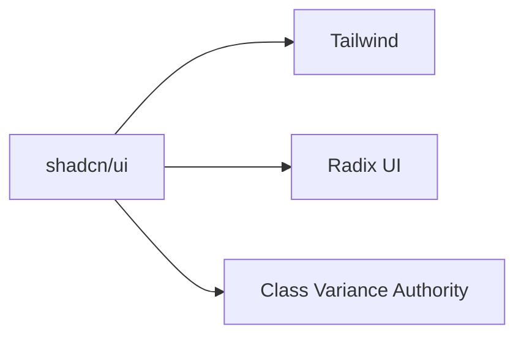

# [React useState 사용하기](https://youtu.be/G3qglTF-fFI?si=44ljf0FoAX2fgQkk)

## 프로젝트 개요
Vite + React + TypeScript로 구현된 시간 업데이트 애플리케이션

## 주요 기능
- 현재 시간 표시
- 업데이트 버튼으로 시간 증가

## 이벤트 핸들링 비교

### 1. React(JSX) 방식
<!-- onClick은 react의 이벤트 핸들러 속성.  -->
```tsx
<button onClick={() => setTime(time + 1)}>
  update
</button>
```

### 2. 순수 JavaScript 방식
```html
<button id="updateBtn">update</button>

<script>
   // HTML 개체인 button을 js 개체인 btn에 할당
  const btn = document.getElementById('updateBtn');
  // js 개체에 발생하는 이벤트를 모니터링 하다가 click 이벤트 발생시 실행할 함수까지 등록
  btn.addEventListener('click', () => {
    time += 1;
    document.querySelector('.time-display').textContent = `현재시각: ${time}시`;
  });
</script>
```

## 이벤트 핸들러 전달 방식

### 1. 함수 참조 직접 전달 (권장)
<!-- 
onClick의 본질 : props 속성으로, 컴포넌트에 전달되는 이벤트 등록용 프로퍼티
- 등록: handleClick 함수 참조가 onClick prop으로 전달
실행: 실제 클릭 이벤트 발생 → React가 등록된 handleClick 호출 
-->
```tsx
<button onClick={handleClick}>
```
- **장점**: 
  - 컴포넌트 재렌더링 시 새 함수 생성되지 않음 (성능 향상)
  - 코드 가독성 및 유지보수성 우수
- **사용 시기**: 대부분의 경우에 적합

### 2. 인라인 화살표 함수
```tsx
<button onClick={() => setTime(time + 1)}>
```
- **장점**: 간단한 로직에 적합
- **주의점**: 
  - 매 렌더링 시 새 함수 생성
  - 복잡한 로직일 경우 가독성 저하

### 3. 기술적 배경
- JSX에서 `{}`는 모든 JavaScript 표현식(expression)을 허용
- 함수는 JavaScript에서 1급 객체이므로 값으로 전달 가능
- 함수 호출(`handleClick()`)이 아닌 참조(`handleClick`) 전달 필요

## React Props 기본 개념

### 1. props의 정의
- **props**(properties): 부모 컴포넌트에서 자식 컴포넌트로 데이터를 전달하는 메커니즘
- 읽기 전용(read-only)이며 자식 컴포넌트에서 수정 불가

### 2. 주요 특징
| 특징 | 설명 |
|------|------|
| **단방향 데이터 흐름** | 부모 → 자식 방향으로만 전달 |
| **다양한 타입 지원** | 문자열, 숫자, 함수, JSX 등 모두 전달 가능 |
| **TypeScript 지원** | 인터페이스로 타입 안정성 보장 |

### 3. 사용 예시
```tsx
// 부모 컴포넌트
function Parent() {
  return <Child message="안녕하세요" count={10} />;
}

// 자식 컴포넌트
interface ChildProps {
  message: string;
  count: number;
}

function Child({ message, count }: ChildProps) {
  return <div>{message} {count}번</div>;
}
```

### 4. props vs state
|  | props | state |
|--|-------|-------|
| **변경 가능성** | ❌ (읽기 전용) | ⭕ (setState로 변경) |
| **사용 목적** | 컴포넌트 간 통신 | 컴포넌트 내부 상태 관리 |

### 5. 이벤트 핸들러 전달
```tsx
<Button onClick={handleClick} />
```
- 함수도 props로 전달 가능
- `onClick`은 prop 이름, `handleClick`은 이벤트 핸들러 함수

## 경로 별칭(Path Alias) 설정

### 1. `@/` 의미
- `@/`는 프로젝트의 `src` 디렉토리를 가리키는 절대 경로 별칭
- 예시: `@/components` → `src/components`

### 2. 설정 방법 (Vite 프로젝트)
```ts
// vite.config.ts
import path from 'path'

export default defineConfig({
  resolve: {
    alias: {
      '@': path.resolve(__dirname, 'src')
    }
  }
})
```

### 3. TypeScript 지원 추가
```json
// tsconfig.json
{
  "compilerOptions": {
    "paths": {
      "@/*": ["src/*"]
    }
  }
}
```

### 4. 사용 예시
```tsx
// 상대 경로 대비 장점
import Button from '@/components/Button'  // vs '../../../components/Button'
import utils from '@/utils/helpers'      // vs '../../utils/helpers'
```

### 5. 주요 장점
- 깊은 네스팅 구조에서도 간결한 임포트
- 파일 이동 시 경로 수정 불필요
- 프로젝트 전체 일관된 경로 체계

## UI 스타일링 솔루션 비교: Tailwind CSS vs shadcn/ui

### 1. 기본 개념 비교
| 특성          | Tailwind CSS            | shadcn/ui               |
|---------------|-------------------------|-------------------------|
| 유형          | CSS 유틸리티 프레임워크 | 컴포넌트 라이브러리      |
| 설치          | `npm install tailwindcss` | `npx shadcn-ui@latest add [컴포넌트]` |
| 스타일링 방식 | 유틸리티 클래스 조합     | 미리 설계된 컴포넌트 사용 |

### 2. 기술 스택


### 3. 코드 예시
#### Tailwind 단독 사용
```tsx
<button className="bg-blue-500 hover:bg-blue-700 text-white py-2 px-4 rounded">
  Click me
</button>
```

#### shadcn/ui 사용
```tsx
import { Button } from "@/components/ui/button";

<Button variant="destructive">Delete</Button>
```

### 4. 주요 차이점
- **추상화 수준**: 
  - Tailwind: 로우레벨 스타일링
  - shadcn: 고수준 컴포넌트 제공
- **커스터마이징**: 
  - Tailwind: 설정 파일로 확장
  - shadcn: 컴포넌트 소스 직접 수정
- **번들 크기**: 
  - 둘 다 사용한 부분만 포함(Tree-shaking)

### 5. 사용 시나리오
- **Tailwind 선택 시**: 
  - 100% 커스텀 디자인 필요할 때
  - 유연한 스타일링 시스템 필요 시

- **shadcn 선택 시**:
  - 빠른 프로토타이핑 필요할 때
  - 접근성/반응형이 내장된 컴포넌트 필요 시

## Tailwind CSS 설치 가이드

### 1. 필수 패키지 설치
```bash
npm install -D tailwindcss postcss autoprefixer
npx tailwindcss init -p
```

### 2. package.json 의존성 확인
```json
"devDependencies": {
  "tailwindcss": "^4.1.8",
  "postcss": "^8.5.4", 
  "autoprefixer": "^10.4.21"
}
```

### 3. tailwind.config.js 설정
```javascript
/** @type {import('tailwindcss').Config} */
module.exports = {
  content: [
    "./index.html",
    "./src/**/*.{js,ts,jsx,tsx}",
  ],
  theme: {
    extend: {},
  },
  plugins: [],
}
```

### 4. 전역 CSS 적용
```css
/* src/index.css 또는 src/App.css */
@tailwind base;
@tailwind components;
@tailwind utilities;
```

### 5. 개발 서버 실행
```bash
npm run dev
```

### 6. shadcn/ui 설치 준비 완료
이제 다음 명령어로 컴포넌트 추가 가능.
shadcn은 tailwind 기반이므로, 사전에 tailwind 설치는 필수
```bash
npx shadcn@latest add button
```

## React 컴포넌트 설계 가이드

### 1. 컴포넌트 분리 원칙
- **UI 컴포넌트**: 순수 표기용 (Button, Card 등)
- **컨테이너 컴포넌트**: 비즈니스 로직 포함
- **기능 컴포넌트**: 독립적 기능 단위

### 2. 실제 코드베이스 리팩토링 결과
- 시간 표시 및 버튼 UI를 `src/components/features/TimeDisplay.tsx`로 분리
- App 컴포넌트는 시간 상태와 핸들러만 관리, UI는 TimeDisplay에 위임
- 폴더 구조를 권장 구조에 맞게 생성 및 정비

### 3. 적용 예시

**src/components/features/TimeDisplay.tsx**
```tsx
interface TimeDisplayProps {
  time: number;
  onUpdate: () => void;
}

const TimeDisplay = ({ time, onUpdate }: TimeDisplayProps) => (
  <div>
    <span>현재시각: {time}시&nbsp;</span>
    <button onClick={onUpdate}>update</button>
  </div>
);

export default TimeDisplay;
```

**src/App.tsx**
```tsx
import { useState } from 'react'
import reactLogo from './assets/react.svg'
import viteLogo from '/vite.svg'
import './App.css'
import TimeDisplay from '@/components/features/TimeDisplay'

function App() {
  const [time, setTime] = useState(1)

  const handleClick = () => {
    setTime(time + 1)
  }

  console.log('App 컴포넌트가 다시 렌더링되었습니다.')

  return (
    <>
      {/* 상단 로고 */}
      <div>
        <a href="https://vite.dev" target="_blank">
          
        </a>
        <a href="https://react.dev" target="_blank">
          
        </a>
      </div>
      {/* 시계 */}
      <TimeDisplay time={time} onUpdate={handleClick} />
    </>
  )
}

export default App
```

### 4. 폴더 구조
```
src/
├─ components/
│  ├─ ui/       # Button, Input 등
│  └─ features/ # Timer, Counter 등
├─ hooks/       # useTimer 등
└─ utils/       # 공용 함수
```

### 5. 추가 안내
- TimeDisplay.tsx에서 `import React from "react"`는 더 이상 필요하지 않으므로 삭제 가능
- 앞으로도 기능별로 `src/components/features/`에 컴포넌트를 분리하여 관리
- 컴포넌트별로 props를 명확히 정의하여 재사용성과 유지보수성을 높임

### 6. 함수 Props 타입 정의 원칙

#### `onUpdate: () => void` 설계 의도
```ts
interface TimeDisplayProps {
  onUpdate: () => void; // 인자 없이 호출되는 함수
}
```
- **What(무엇)**: TimeDisplay는 "시간 업데이트 요청"만 담당
- **How(어떻게)**: 실제 구현은 부모 컴포넌트(App)가 결정
- React의 핵심 철학 중 하나는:
```
"상태는 필요한 곳에서 한 번만 관리하고, 필요한 자식에게 내려보내라."

자식 컴포넌트는 UI를 보여주는 역할만 하게 하고,
상태 변경이나 처리 로직은 상위에서 한 곳에서 집중적으로 관리하는 것이 좋습니다.
```

#### 사용 예시
```tsx
// 1. 타입 정의
interface TimeDisplayProps {
  onUpdate: () => void;
}

// 2. 컴포넌트 정의 - 이곳에서 타입을 사용
const TimeDisplay = ({ onUpdate }: TimeDisplayProps) => (
  <button onClick={onUpdate}>update</button>
);

// 3. 부모 컴포넌트에서 props 전달
<TimeDisplay onUpdate={() => setTime(time + 1)} />

```

#### 장점
- 컴포넌트의 순수성(재사용성) 유지
- 부모가 원하는 방식으로 동작을 결정할 수 있어 유연함
- 타입스크립트가 함수 시그니처를 체크해주므로 안전함

### 7. 추가 안내
- TimeDisplay.tsx에서 `import React from "react"`는 삭제 가능
- `src/components/features/`에 기능 컴포넌트 분리
- Props 타입을 명확히 정의해야:
  - 재사용성 ↑
  - 유지보수성 ↑
  - 타입 안정성 ↑

## 경로 별칭(Path Alias) 설정 및 문제 해결

### 1. 왜 경로 별칭을 쓰는가?
- `@/components/...`와 같이 절대경로로 import하면 폴더 구조가 바뀌어도 코드 수정이 쉬워집니다.
- 상대경로(`../../components/...`)보다 가독성이 좋고 유지보수에 유리합니다.

### 2. Vite에서 '@' 별칭 설정 방법

#### vite.config.ts
```ts
import { defineConfig } from 'vite'
import react from '@vitejs/plugin-react'
import path from 'path'

export default defineConfig({
  plugins: [react()],
  resolve: {
    alias: {
      '@': path.resolve(__dirname, 'src'),
    },
  },
})
```

#### tsconfig.app.json (또는 tsconfig.json)
```json
{
  "compilerOptions": {
    "baseUrl": ".",
    "paths": {
      "@/*": ["src/*"]
    }
  },
  "include": ["src"]
}
```

### 3. 에러 발생 시 체크리스트
- `vite.config.ts`에 alias 설정이 있는가?
- `tsconfig.app.json` 또는 `tsconfig.json`에 paths 설정이 있는가?
- 설정 변경 후 VS Code를 재시작했는가?
- 타입스크립트 서버를 재시작했는가?

### 4. 자주 나오는 에러와 원인
| 에러 메시지 | 원인 | 해결 방법 |
|-------------|------|------------|
| 모듈 또는 해당 형식 선언을 찾을 수 없습니다 | alias, paths 설정 누락 | 설정 추가 및 VS Code 재시작 |
| 'path' 이름을 찾을 수 없습니다 | path import 누락 | `import path from 'path'` 추가 |

---

## 개발 환경 vs 프로덕션 빌드

### 개발 모드 (`npm run dev`)
```bash
npm run dev
```

#### 핵심 특징
1. **Zero-Build 개발 경험**:
   - Vite는 개발 서버 실행 시 사전 빌드 없이 즉시 애플리케이션 실행
   - 파일 수정 시 변경된 모듈만 온디맨드 컴파일 → 전체 빌드 불필요 (npm run build 명령 필요없음)
   - 브라우저가 ESM 모듈을 직접 처리하므로 번들링 과정 생략

2. **실시간 반영 시스템**:
   - 코드 변경 → 변환(TS → JS 등) → HMR 업데이트 (평균 50ms 이내)
   - 기존 번들러(Webpack 등) 대비 10~100배 빠른 업데이트 속도

3. **에셋 처리**:
   - 이미지, CSS 등 정적 자산도 네이티브 ESM으로 제공
   - 변환 필요 시 즉시 처리(예: Sass → CSS)

#### 작동 원리
1. **ESM 기반 번들링**: 
   - 브라우저가 직접 ES 모듈을 import할 수 있게 지원
   - 종속성 그래프를 미리 빌드하고 캐싱 (`.vite/deps` 폴더)

2. **HMR(Hot Module Replacement)**:
   - 파일 변경 감지 → 변경 모듈만 변환 → 브라우저에 실시간 전송
   - 전체 페이지 리로드 없이 상태 유지하며 UI 업데이트

3. **소스맵 제공**:
   - 원본 코드(TS/JSX) 형태로 디버깅 가능

4. **빠른 서버 시작**:
   - esbuild로 초기 변환 후, 요청 시 온디맨드 컴파일

### 프로덕션 빌드 (`npm run build`)
```bash
npm run build
```

#### 최적화 과정
1. **Rollup 기반 번들링**:
   - 모든 모듈을 단일/여러 청크로 결합
   - Tree-shaking 적용 (사용되지 않는 코드 제거)

2. **코드 최소화**:
   - Terser로 JS 코드 압축
   - CSS 압축 (기본 포함)

3. **정적 자산 처리**:
   - 이미지, 폰트 등 자동 최적화
   - 파일명 해싱으로 캐싱 전략 구현

4. **출력 구조**:
   ```
   dist/
   ├─ assets/       # 최적화된 정적 자산
   ├─ index.html    # 처리된 HTML
   └─ *.js          # 청크된 번들 파일
   ```

### 비교 표
| 기능               | 개발 모드                | 프로덕션 빌드            |
|--------------------|-------------------------|-------------------------|
| **빌드 속도**      | 빠름 (온디맨드 컴파일)  | 상대적으로 느림          |
| **코드 크기**      | 최적화 없음             | 압축 및 최소화          |
| **디버깅**         | 소스맵 지원             | 난독화 적용             |
| **사용 목적**      | 개발 중 실시간 피드백   | 실제 서버 배포용         |

## TypeScript 인터페이스 vs 클래스
|  | 인터페이스 | 클래스 |
|--|------------|--------|
| **용도** | 타입 검사용 | 객체 생성 + 로직 구현 |
| **JavaScript 변환** | ❌ (컴파일 시 제거) | ⭕ (실제 코드로 유지) |
| **인스턴스화** | 불가능 | `new` 키워드로 생성 가능 |
| **React에서의 사용** | Props 타입 정의 | 컴포넌트 구현(클래스 컴포넌트) |

#### 💡 중요 사실
- JavaScript에는 인터페이스 개념이 없음 (TypeScript 전용 기능)
- 인터페이스는 런타임에 완전히 사라지는 순수 타입 정의
- 클래스는 타입으로도 사용 가능하지만, props 정의에는 인터페이스 권장

```typescript
// 올바른 예: 인터페이스로 props 타입 정의
interface Props {
  time: number;
  onUpdate: () => void;
}

// 잘못된 예: 클래스로 props 타입 정의 (과도한 설계)
```typescript
class Props { // ❌ React에서는 이렇게 사용X
  constructor(
    public time: number,
    public onUpdate: () => void
  ) {}
}
```
---

## React 빌드/동적 렌더링 원리

### 1. main.tsx와 App.tsx의 구조
- `main.tsx`는 React 앱의 진입점(entry point)입니다.
- `createRoot(document.getElementById('root')).render(<App />)` 형태로, 오직 **App 컴포넌트 하나만** root DOM에 렌더링합니다.
- 여러 개의 tsx 파일(컴포넌트)을 App 내부에서 자유롭게 조합해 사용할 수 있습니다.
- root에서 여러 컴포넌트를 직접 렌더링하기보다는 App 하나만 렌더링하고, 그 내부에서 필요한 컴포넌트들을 import해 조합하는 것이 표준적입니다.

### 2. 빌드 단계에서 생성되는 것
- 빌드 시점(`npm run build`)에는 오직 **정적 파일**(index.html, 번들된 js, css 등)만 생성됩니다.
- 이때는 사용자별 데이터/상태/조건에 따라 달라지는 실제 화면(HTML)은 미리 만들어지지 않습니다.
- 즉, build 결과물은 모든 사용자에게 동일한 파일입니다.

### 3. 서비스(런타임) 단계에서의 동적 렌더링
- 사용자가 브라우저에서 사이트에 접속하면, 브라우저가 정적 파일을 받아와서 JS를 실행하고 React 앱이 동작을 시작합니다.
- 이때부터 React가 사용자의 상태/입력/데이터에 따라 **동적으로 컴포넌트 트리를 렌더링**합니다.
- 즉, 실제로 사용자마다 보게 되는 HTML은 브라우저에서 JS가 실행된 결과입니다.
- 상태(state), props, 사용자 입력, 서버 데이터 등에 따라 각 사용자별로 동적으로 화면이 바뀝니다.

### 4. SPA와 SSR/SSG의 차이
- Vite/CRA 등 SPA(싱글 페이지 앱)는 브라우저에서만 동적으로 화면을 만듭니다.
- Next.js 같은 프레임워크의 SSR(서버 사이드 렌더링)이나 SSG(정적 사이트 생성)는 서버에서 사용자별 HTML을 미리 만들어 보내기도 합니다.
- 본 프로젝트는 SPA 구조이므로, 빌드 시점에는 정적 파일만 생성되고, 동적 화면은 모두 브라우저에서 JS가 실행되며 만들어집니다.

### 5. 요약
- 빌드 단계: 사용자 상태와 무관하게 "정적 파일"만 생성
- 서비스(실행) 단계: 각 사용자 환경/상태/데이터에 따라 JS가 브라우저에서 동적으로 HTML, CSS를 만들어서 보여줌

---
